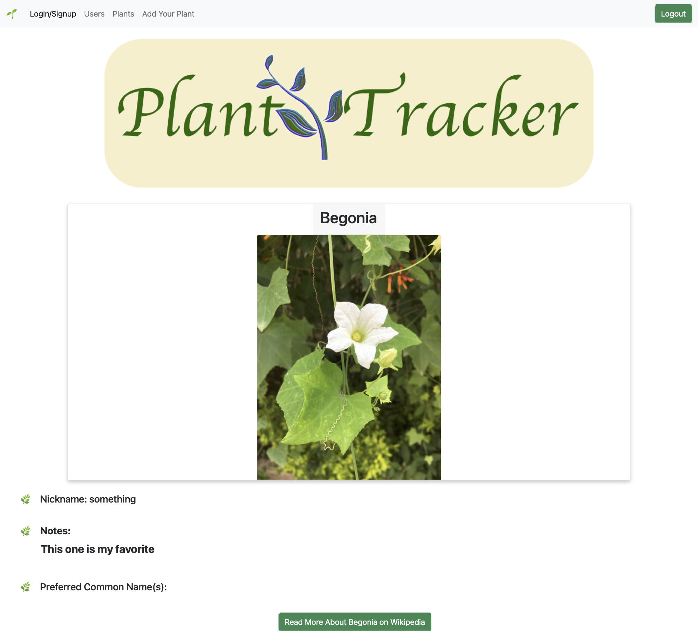

# plant-tracker

## Table of Contents
* [Description](#description)
* [Database Schema](#database-schema)
* [Screenshots](#screenshot)
* [Usage](#usage)
* [Link](#link)
* [Code](#code)
* [Presenation Slides](#presentation-slides)
* [Contact](#contact)
* [Technologies](#technologies)
* [Project Status](#project-status)

## Description 
Plant tracker is a web-based application that allows users to enter and store information about their plants, as well as viewing the plants belonging to other users.  It stores the information that users enter about the plants, and also retrieves data and images from the iNaturalist API.

## Screenshots

## Database Schema
(plant_db)

	• Plants
	    ◦ id
	    ◦ name
	    ◦ nickname
	    ◦ note
		◦ user_id

	• Users
	    ◦ id
	    ◦ name
	    ◦ email
	    ◦ password

## Usage
Plant Tracker can be accessed at the link below.  User sign up is required for full access to the site.

## Link
[Deployed Application]()

## Code
[GitHub Code Repository](https://github.com/Johny49/plant-tracker)

## Presentation Slides
[Plant Tracker Presentation](https://docs.google.com/presentation/d/1NnVGOOHzFjel_rjoyKb4auf2ocp1mkgGj8TYmKaqpDQ/edit?usp=sharing)

## Contact 
Created by:
• [@jacobotaylor](https://github.com/jacobotaylor)
• [@wparker05](https://github.com/wparker05)
• [@FatherWolf](https://github.com/FatherWolf)
• [@johny49](https://github.com/Johny49/)

## Technologies
- JavaScript
- CSS
- Heroku
- Node.js
- Express
- MySQL
- Sequelize
- bcrypt
- Bootstrap
- Handlebars
- iNaturalist API
- Axios

## Project Status
Project is: completed

Potential future improvements include:
* Add support for users to upload their own plant images
* Allow users to add search and add a plant from a list
* Allow commenting on another user’s plants
* Support deleting and modifying saved plants
